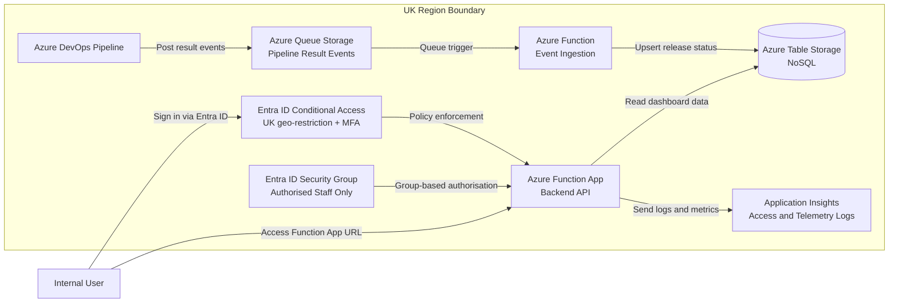

# Design Cloud Based Tool <!-- 1200 words -->

## Requirements Gathering

### Functional Requirements

Functional requirements define what the cloud-based delivery visibility tool must do to meet stakeholder needs.

- Aggregate delivery and release data from multiple Azure DevOps projects into a single organisation-wide view.
- Show deployment status by environment (development, test, production) for each application or service.
<!-- - Provide end-to-end traceability from change request/work item to build, test, and deployment outcome. -->
- Display a timeline of recent releases with version number, deployment time, and impacted services.
<!-- - Highlight failed pipelines, blocked releases, and environment drift between stages. -->
<!-- - Provide role-based views for developers/testers, project and release managers, support, and business owners. -->
- Support search and filtering by project, application, service, environment, release version, and status.
<!-- - Provide reporting views for key delivery metrics such as deployment frequency, lead time, and change failure rate. -->

### Non-Functional Requirements

Non-functional requirements define how well the tool must perform in terms of quality, reliability, and operational fit.

- Availability: The platform should achieve at least 99.9% monthly uptime.
- Performance: Dashboard and reporting pages should load in under 2 seconds at the 95th percentile under normal load.
- Data freshness: Pipeline and deployment updates should be reflected within 5 minutes of source-system change.
- Scalability: The solution should support growth to at least 200 services and 1,000 daily pipeline events without major redesign.
- Reliability: Ingestion and processing should recover automatically from transient failures using retry and dead-letter handling.
- Security: Access should use enterprise identity, role-based access control, and encryption in transit and at rest.
- Maintainability: Infrastructure and deployment should be managed via IaC and CI/CD to reduce manual effort.
- Usability: Core stakeholder tasks should be completed in three clicks or fewer.
<!-- - Interoperability: The platform should allow extension to additional tooling sources beyond Azure DevOps with minimal rework. -->

### Security Requirements

Non-staff members should have absolutely no access to the dashboard at all. It should only be accessible to members of a particular security group via 2 Factor Authentication (2FA) and enrolment into the group should be managed via the security team following the creation of a support ticket with line manager approval.

While the URL _could_ exist publically there should be absolutely no access without having to sign on first. Sign ons should also be logged and monitored as well as restricted to UK logins only.

## Solution Design

TODO: Explain what a function app is
TODO: Add references (Microsoft docs)

The design uses an event-driven Azure architecture so pipeline outcomes are captured in near real time and exposed through a secure, lightweight dashboard API.

In this model, Azure DevOps emits pipeline outcomes to a queue, an ingestion function normalises and stores the records in a simple NoSQL store (Azure Table Storage), and a separate Function App serves the dashboard backend. Access to the Function App is restricted to members of a specific Entra ID security group, with MFA and UK-only conditional access policies enforced before requests are accepted. Application Insights captures authentication, request, and operational telemetry for audit and support.

### Alternative Storage and Platform Options

Azure Table Storage is the baseline because it is low cost, simple, and well suited to key-value release events. Viable alternatives are:

- Azure Cosmos DB: Prefer when low-latency global scale or richer querying is required; trade-off is higher cost.
- Azure SQL Database: Prefer when relational joins and structured reporting are central; trade-off is tighter schema and more administration.
- Azure Data Explorer/Log Analytics: Prefer for large-scale time-series and operational analytics; trade-off is less suitability for transactional API reads.
- Blob Storage (parquet/json): Best for low-cost archive/history; trade-off is not suitable as the live dashboard store.

Additional platform substitutions:

- Azure Service Bus instead of Queue Storage for ordered processing and advanced messaging controls.
- Container Apps/AKS instead of Functions for long-running workloads or stricter container portability.
- API Management in front of the Function App for throttling, versioning, and consumer governance.

### Networking Considerations

The networking design must balance UK residency, secure access, and low-latency event flow.

- UK data boundary: Place queue, functions, storage, and telemetry in UK regions to meet residency requirements.
- Secure ingress: Enforce Entra sign-in, MFA, and UK-only Conditional Access before Function App access is granted.
  - Conditional Access rules could also be extended to device level if necessary
- Private service paths: Use private endpoints and VNet integration for storage/telemetry to minimise public exposure. TODO: Read up more about this
- Controlled egress: Restrict outbound calls to approved Azure DevOps and Azure platform endpoints.
  - This site is 'read only' so in fact no outbound calls should be possible.
- Performance and resilience: Keep ingestion and storage co-located and use retry/dead-letter plus geo-redundant storage where recovery objectives require it.
- Network observability: Track dependency latency, throttling, and failed calls in Application Insights.
  - Add alarms for failed calls and health checking 

<!--
=== REPORT STRUCTURE — What to cover in this section ===

• Interpret your organisation's functional, non-functional, and security requirements (K24).
• Design a cloud-based architectural solution that addresses these requirements (K24).
• Explain how your design considers performance, flexibility, resource optimisation,
  and scalability (K24).
• Describe how your design could adapt to changing organisational priorities (S20).

=== MARKING RUBRIC — LO2: K24 ===

B grade:
Analyses trade-offs between design alternatives (e.g. Serverless vs. Containers). Synthesises testing data to evaluate quality controls and resource optimisation.

A grade:
Critically evaluates design effectiveness across multiple failure scenarios. Justifies the selection of architectural patterns against legacy system constraints.

=== MARKING RUBRIC — LO3: S20 ===

B grade:
Analyses different approaches to responding to change. Demonstrates how adapted plans influenced team outcomes or project deliverables.

A grade:
Critically evaluates the implications of adapted plans on project success. Compares and contrasts adaptation strategies, justifying the most resilient approach and considering future implications.

=== KSB DESCRIPTIONS ===

K24: How to interpret and implement a design, compliant with functional, non-functional and security requirements including principles and approaches to addressing legacy software development issues from a technical and socio-technical perspective. For example, architecture, languages, operating systems, hardware, and business change.

S20: Respond to changing priorities and problems arising within software engineering projects by making revised recommendations, and adapting plans as necessary, to fit the scenario being investigated.
-->
