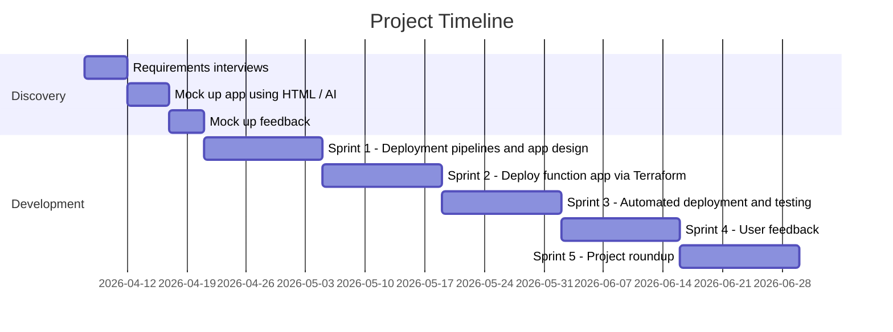

# Develop Cloud Based Tool <!-- 1200 words -->

IMPORTANT: REFER BACK TO THE FUNCTIONAL, NON-FUNCTIONAL and SECURITY requirements here.

## Development Workflow

We used Azure DevOps boards to capture all the tasks, split these into sprints, create milestones and report against them. Tags were used (functional, non-functional, security) to make sure all the requirements were covered off and grouped for review against the intial specification. 

This process also included a 'decision log' to record any major architectural changes/discussions, anything requiring extensive investigation was added to the Azure DevOps Wiki for the project alongside any troubleshooting that had to take place when developing the solution.

As far as deploying the solution goes, we went down the function app (serverless) route as the most straight forward option available. Although containers could also have worked the additional networking/security to host these didn't justify the effort. The function app presents an endpoint with a header token to avoid it being attacked by people posting malicious entries, as well as user control sitting behind Entra ID Easy Auth (Microsoft Entra Sign In) as all users have Entra ID accounts (cephalin, 2025)

This 'cloud native' deployment method is far more efficient than the historical approach where your only option would have been to write an application and run it on a full server. That would have also come with patching, security, os update and other networking/access headaches.

It 'could' be argued that having an Azure Serverless function restricts it's portability to other cloud providers (AWS, Google) but this would be the same sort of issue with a container runtime. Another argument against could be that 'local' i.e. making and testing changes on a users machine isn't possible with serverless but nowadays Python, Rust and other serverless runtimes have full local language build support. You don't need to upload your function code to the cloud in order for it to run or be tested.

We're not really having to manage persistent state and there's only a single endpoint so a function app is the least complex approach while still retaining portability - the function code could still be easily moved to another cloud with only minor tweaks.


Figure 2: Project Timeline

Sprint 1 focusses on setting up deployment pipelines so that the project resources are created in Azure from the very beginning.

Having this sort of automation from the start means it can be destroyed and recreated very easily as well as providing a safety net if someone makes a catastrophic mistake in configuration or deploying changes later. 

Terraform IaC (infrastructure as code) provides a means automatically deploy infrastructure, keep a record of changes and allow multiple developers to work on the same Azure resources in parallel.

## Challenges encountered

### Publishing events
Publishing from a pipeline run to an accessible but secure endpoint

### Event Design

We need the actual event to be well designed and extensible. It is effectively like a database schema or excel table and is the core 'information unit' about a project and it's commit status which are defined in point 1 of the 'Functional Requirements'

```python
    entity = {
        "PartitionKey": now.strftime("%Y-%m"),
        "RowKey": str(body["buildId"]),
        "PipelineName": str(body.get("pipelineName", "")),
        "BuildNumber": str(body.get("buildNumber", "")),
        "Status": str(body.get("status", "")),
        "Branch": str(body.get("branch", "")),
        "TriggeredBy": str(body.get("triggeredBy", "")),
        "ProjectName": str(body.get("projectName", "")),
        "RepositoryName": str(body.get("repositoryName", "")),
        "Environment": str(body.get("environment", "")),
        "StartTime": str(body.get("startTime", "")),
        "FinishTime": str(body.get("finishTime", "")),
        "DurationSeconds": int(body.get("durationSeconds", 0)),
        "ReceivedAt": now.isoformat(),
        # ── Enrichment fields (all optional) ────────────────────────────
        "ServiceName": str(body.get("serviceName", "")),
        "ReleaseVersion": str(body.get("releaseVersion", "")),
        "CommitId": str(body.get("commitId", "")),
        "CommitTimestamp": str(body.get("commitTimestamp", "")),
        "PullRequestId": str(body.get("pullRequestId", "")),
        "IsRollback": bool(body.get("isRollback", False)),
        "FailureReason": str(body.get("failureReason", "")),
        "FailedStage": str(body.get("failedStage", "")),
        # Work item IDs stored as a JSON array string (Table Storage has no array type)
        "WorkItemIds": json.dumps(body.get("workItemIds", [])),
        "TestsPassed": int(body.get("testsPassed", 0)),
        "TestsFailed": int(body.get("testsFailed", 0)),
    }
```
Figure 3: Work Item Schema

### No-SQL dashboard design

The dashboard was first mocked up by using AI (HTML) to give stakeholders an immediate glimpse as to what they'd be getting. This second round of feedback, driven by looking at something tangible, helped to refine the final design.


Figure 4: App Overview

Meets the key functional requirements showing the data from multiple projects in an organisation wide view alongside deployment status per environment.


Figure 5: Filter View

Allows users to filter to the service they're interested in and click on links to the repo changelog for a more granular code change view.

### Azure DevOps security

As part of the solution deployment we can take advantage of Azure DevOps pipeline controls which give admins the ability to 'lock down' code changes and deployments so best practices are followed.

- PR's require another reviewer before merging into main
- Running the application deployment pipeline for the azure function needs sign off by at least one other authorised team member
- We can use static code analysis pipelines to measure code quality
- We can also add pipeline steps to check the infrastructure (terraform) for security issues (REF: add link to trivvy here and sub-point about this)

### Azure Function and Function App debugging


## Testing Methodology

In order to meet the non-functional requirements (speed, security) etc. a tester was assigned to the project TODO: research testing methodologies - perf, resource utilization, COSTS - not just security. 

Is scalability an issue? Azure functions/function apps are inherantly scalable. 

### Testing Scalability

### Maintainability

### Easy roll-back

## Resilience and recovery from failure

Since we've gone with an Infrastructure as Code (IaC) approach the greatest benefit this holds is that, if the host environment suffer a catastrophic failure, it can be rebuilt simply be re-running the deployment pipeline.

TODO: Other IaC advantages

## Alternative architectures

### Containers

Work is only going to be carried out on a per-change basis and with containers there's actually 'too much' network/infra overhead to justify this. We'd need a queue anyway so... might as well go full serverless...

### Hosted Server

Let's not host a website - that's so 2010's now (Function Apps FTW!!)


<!--
=== REPORT STRUCTURE — What to cover in this section ===

• Implement your cloud-based tool design, documenting techniques and methods used (K24).
• Describe how tools that support teamwork (e.g., configuration management, version control, release management) were or could be used in the development process (K28).
• Test your tool's performance, flexibility, resource optimisation, and scalability (K24).

=== MARKING RUBRIC — LO2: K24 ===

B grade:  
Analyses trade-offs between design alternatives (e.g. Serverless vs. Containers). Synthesises testing data to evaluate quality controls and resource optimisation.

A grade:
Critically evaluates design effectiveness across multiple failure scenarios. Justifies the selection of architectural patterns against legacy system constraints.

=== MARKING RUBRIC — LO4: K28 ===

B grade:
Analyses how tools support distributed teams and code integration. Justifies the use of specific configuration management approaches (e.g. Infrastructure as Code).

A grade:
Evaluates the effectiveness of the teamwork toolchain. Compares alternative tools and justifies selections based on their impact on team productivity and cloud code quality.

=== KSB DESCRIPTIONS ===

K24: How to interpret and implement a design, compliant with functional, non-functional and security requirements including principles and approaches to addressing legacy software development issues from a technical and socio-technical perspective. For example, architecture, languages, operating systems, hardware, and business change.

K28: Approaches to effective teamwork and the range of software development tools supporting effective teamwork. For example, configuration management, version scontrol and release management.
-->
