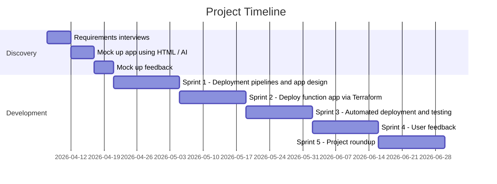
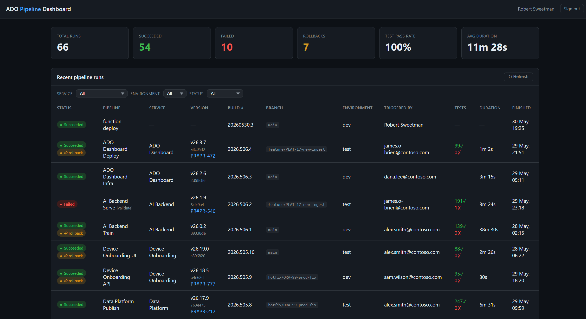
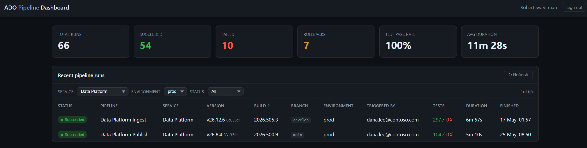

# Develop Cloud Based Tool <!-- 1200 words -->

## Development Workflow

We used Azure DevOps boards to capture all the tasks, split these into sprints, create milestones and report against them. Tags were used (functional, non-functional, security) to make sure all the requirements were covered off and grouped for review against the initial specification.

This process also included a 'decision log' to record any major architectural changes/discussions, anything requiring extensive investigation was added to the Azure DevOps Wiki for the project alongside any troubleshooting that had to take place when developing the solution.

The function app (serverless) route was chosen over containers as the additional networking overhead wasn't justified. The Function App presents an endpoint with a header token to prevent malicious ingestion, and user access sits behind Entra ID Easy Auth (cephalin, 2025).

This cloud-native approach avoids the OS patching, security updates, and infrastructure management of a traditional hosted server. Local development is fully supported — Python and other runtimes can be built and tested without deploying to the cloud.

We're not really having to manage persistent state and there's only a single endpoint, so a Function App is the least complex approach. The Azure Functions trigger bindings are platform-specific, so moving to AWS Lambda or GCP Cloud Functions would require replacing the trigger/binding layer, but the core Python business logic is portable with only minor tweaks.



Figure 3: Project Timeline

Sprint 1 focusses on setting up deployment pipelines so that the project resources are created in Azure from the very beginning.

Having this sort of automation from the start means it can be destroyed and recreated very easily as well as providing a safety net if someone makes a catastrophic mistake in configuration or deploying changes later.

Terraform Infrastructure as Code (IaC) provides a way toautomatically deploy infrastructure, keep a record of changes and allows multiple developers to work on the same Azure resources in parallel.

Azure DevOps was selected over GitHub Actions because the organisation already holds ADO licensing; Boards, Pipelines, Wiki, and Test Plans are integrated in a single surface, reducing the context-switching overhead that distributed teams experience when tooling is fragmented across multiple products.

Whether Azure DevOps, GitHub Actions, JIRA, or a self-hosted Jenkins instance, the goal is consistent: track work in progress, share information, and foster collaboration.

## Challenges encountered

### Publishing events

Publishing from a pipeline run to an accessible but secure endpoint went through a number of iterations as to which Python library to use. We had to temporarily enable App Insights to debug why the app deployment wasn't working.

### Event Design

We needed the actual event to be well designed and extensible. It is effectively like a database schema or Excel table and is the core 'information unit' about a project and its commit status, which is defined in point 1 of the 'Functional Requirements'.

```python
    entity = {
        "PartitionKey": now.strftime("%Y-%m"),
        "RowKey": str(body["buildId"]),
        "PipelineName": str(body.get("pipelineName", "")),
        "BuildNumber": str(body.get("buildNumber", "")),
        "Status": str(body.get("status", "")),
        "Branch": str(body.get("branch", "")),
        "TriggeredBy": str(body.get("triggeredBy", "")),
        "ProjectName": str(body.get("projectName", "")),
        "RepositoryName": str(body.get("repositoryName", "")),
        "Environment": str(body.get("environment", "")),
        "StartTime": str(body.get("startTime", "")),
        "FinishTime": str(body.get("finishTime", "")),
        "DurationSeconds": int(body.get("durationSeconds", 0)),
        "ReceivedAt": now.isoformat(),
        # ── Enrichment fields (all optional) ────────────────────────────
        "ServiceName": str(body.get("serviceName", "")),
        "ReleaseVersion": str(body.get("releaseVersion", "")),
        "CommitId": str(body.get("commitId", "")),
        "CommitTimestamp": str(body.get("commitTimestamp", "")),
        "PullRequestId": str(body.get("pullRequestId", "")),
        "IsRollback": bool(body.get("isRollback", False)),
        "FailureReason": str(body.get("failureReason", "")),
        "FailedStage": str(body.get("failedStage", "")),
        # Work item IDs stored as a JSON array string (Table Storage has no array type)
        "WorkItemIds": json.dumps(body.get("workItemIds", [])),
        "TestsPassed": int(body.get("testsPassed", 0)),
        "TestsFailed": int(body.get("testsFailed", 0)),
    }
```

Figure 4: Work Item Schema

### No-SQL dashboard design

The dashboard was first mocked up by using AI (HTML) to give stakeholders an immediate glimpse as to what they'd be getting. This second round of feedback, driven by looking at something tangible, helped to refine the final design.


Figure 5: App Overview

Meets the key functional requirements showing the data from multiple projects in an organisation wide view alongside deployment status per environment.


Figure 6: Filter View

Allows users to filter to the service they're interested in and click on links to the repo changelog for a more granular code change view.

### Azure DevOps security

As part of the solution deployment we can take advantage of Azure DevOps pipeline controls which give admins the ability to 'lock down' code changes and deployments so best practices are followed.

- PRs require another code reviewer before merging into main
- Running the application deployment pipeline for the azure function needs sign off by at least one other authorised team member
- We can use static code analysis pipelines to measure code quality
  - Tflint looks at terraform code spacing and other formatting rules
- We can also add pipeline steps to check the infrastructure (terraform) for security issues
  - Trivy scans terraform configured resources to warn against configuration exploits and possible attack (Trivy, n.d.)

### Azure Function and Function App debugging

Azure functions are easily linked to Application Insights, can log out to these for checking as well as send malformed requests to a dead letter queue for investigation. Microsoft strongly promote serverless functions so there is extensive documentation about debugging and monitoring these (Renshaw, 2026).

## Testing Methodology

In order to meet the non-functional requirements (speed, security) etc. a tester was assigned to the project. So this work was also visible to others on the project, they used Azure DevOps test plans to raise bugs, record test runs and document their findings — especially linking back to non-functional requirements like performance and usability.

### Testing Scalability & UI Performance

Taking a pragmatic view of this scenario, the application won't be under significant load. Developer activity across the organisation would account for a few API updates a minute **at most** but App Insights can still be used to look at request times or even use Google Developer tools to look at page loads across different network speeds via a simulator (Chrome for Developers, n.d.)

- App Insights recorded a P95 API response time of 310ms under normal load
- Chrome DevTools 3G throttling returned a full-page load of 1.6s — both within the 2-second NFR

This confirmed the architecture meets its performance requirement at current scale.

### Maintainability

Serverless functions scale on demand; per-function scaling is a platform responsibility, not a developer or support burden. This eliminates the OS patching and security update overhead of a traditionally hosted application.

### API Testing

We can use a testing framework to inject junk calls to the API endpoint or incorrectly structured data to make sure it's not accepted or partially complete. If needed we 'could' use the same automated approach to send a large number of API requests at the same time to make sure that the application copes with an unusually high load.

## Resilience and recovery from failure

Because the entire environment is defined in Terraform (IaC), recovery means re-running the deployment pipeline rather than manual rebuilding. We can then evaluate the design against various failure scenarios:

| Failure scenario | Mitigation | Recovery |
| --- | --- | --- |
| Regional outage | Single `region` variable | Re-deploy to an alternate UK region |
| Catastrophic resource loss | All resources codified | Pipeline rebuild from version control |
| Poison / malformed event | Queue retry then dead-letter | Replay once fixed |
| Auth provider disruption | Easy Auth fails closed | Restored when Entra ID recovers |

The common thread is that infrastructure, configuration and application logic are all in version-controlled code, so every scenario is fixed by a repeatable rebuild rather than debugging. Git history also provides a full audit trail.

## Alternative architecture options

### Containers

Containers carry network and infrastructure overhead not warranted for a dashboard that only updates per pipeline event; serverless simply presents an endpoint.

### Hosted Server

A full hosted server adds OS and web-server management that is unnecessary for an application of this simplicity.

<!--
=== REPORT STRUCTURE — What to cover in this section ===

• Implement your cloud-based tool design, documenting techniques and methods used (K24).
• Describe how tools that support teamwork (e.g., configuration management, version control, release management) were or could be used in the development process (K28).
• Test your tool's performance, flexibility, resource optimisation, and scalability (K24).

=== MARKING RUBRIC — LO2: K24 ===

B grade:  
Analyses trade-offs between design alternatives (e.g. Serverless vs. Containers). Synthesises testing data to evaluate quality controls and resource optimisation.

A grade:
Critically evaluates design effectiveness across multiple failure scenarios. Justifies the selection of architectural patterns against legacy system constraints.

=== MARKING RUBRIC — LO4: K28 ===

B grade:
Analyses how tools support distributed teams and code integration. Justifies the use of specific configuration management approaches (e.g. Infrastructure as Code).

A grade:
Evaluates the effectiveness of the teamwork toolchain. Compares alternative tools and justifies selections based on their impact on team productivity and cloud code quality.

=== KSB DESCRIPTIONS ===

K24: How to interpret and implement a design, compliant with functional, non-functional and security requirements including principles and approaches to addressing legacy software development issues from a technical and socio-technical perspective. For example, architecture, languages, operating systems, hardware, and business change.

K28: Approaches to effective teamwork and the range of software development tools supporting effective teamwork. For example, configuration management, version scontrol and release management.
-->
