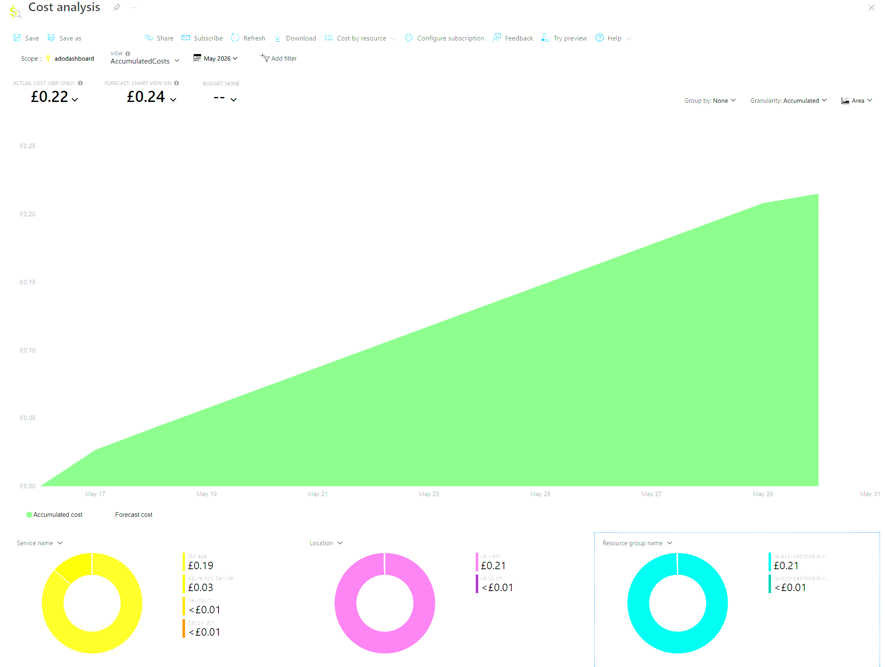

# Conclusion and Recommendations <!-- 800 words -->

## ROI

Ongoing cost is very low with the projected bill for May being only about 25 pence althought he app service machine this is running on costs about £10 per month total.

Figure 7: Monthly subscription costs

ROI in terms of time saved is therefore very high.

Even if across the whole business we save a dozen people about half an hour per week each avoiding chasing for stats updates...

12 (people) x 0.5 (half an hour) x 24 (hourly rate in GBP) x 4 (weeks per month) = £576 per month

ROI is therefore ridiculously high at > 5,000% (TODO: return per £1)

## Further enhancements and reliability

### Enhance AI Use

We could attach an AI MCP server to the database backend so people can ask natural language questions about the various projects.

An example might be "Which service has had the most updates in the last 12 months?" or "Which project has the most failed deployments in the last month?"

This would be a significant useability enhancement which users could interact with via a text box in the site. Wiring this up to Azure's AI interface would be via Terraform (IaC) as with all the other resources.

This would likely increase the cost upwards but given the useability improvements for stakeholders it would be worth upping the costs to £20 per month or more.

### DORA metric comparison

We could improve the record schema to include more things - especially related to DORA metrics (Dora.dev, 2021) which are leading and lagging indicators for software development excellence.

#### Throughput

- Change lead time - time for a new feature from start to production usage
- Deployment Frequency - number of deployments per time period
- Failed Deployment Recovery Time - how long it takes to recover from a failed deployment

#### Instability

- Change Fail Rate - rate of deployments requiring immediate fixes
- Deployment rework rate - ratio of deployments to fix prod issues

These metrics can then benchmark the organisation against it's peers as opposed to taking an unreliable "finger in the air" view of the current state of development.

### Scalability Upgrade Triggers

If monthly event volume did manage to exceed 50,000 rows or dashboard query latency increases then migrating the NoSQL backend from Azure Table Storage to Cosmos DB would add richer indexing with minimal schema change. Replacing Queue Storage with Azure Service Bus would add further queue handling functionality.

Both upgrades would be deliverable via Terraform without architectural rework.

## Summary

This cloud-based tool delivers a secure dashboard that shows application releases and deployment status across the organisation.

It uses an event-driven architecture that posts Azure DevOps pipeline status messages which are picked up by Azure functions and stored in a NoSQL backend. The function app uses this backend as the basis for the dashboard which is only accessible via Entra ID access using 2FA.

Application insights monitoring, especially around user logins, complete the security protecting this sensitive data.

By making this information widely accessible across the organisation a high ROI is achieved by reducing status reporting meetings, cross team calls, faster triage of release based issues while running on low cost serverless and managed cloud resources.

Organisations should roll this out in phases with one ADO project, check the pipeline and event schema works and then onboarding the others. This reduces risk and will highlight any integration issues before users are exposed to the application.

As AI assisted coding increases deployment frequency the number and speed of pipeline events will grow. Organisations using AI already report a significant increase in commit frequency (GitHub Staff, 2025) so a dashboard like this becomes more critical.

Automated aggregation tracking dozens of changes across services lessens cognitive load and plugging in the DORA metrics extension into this view would also help the organisation guague whether their use of AI is genuinely improving stability or just speeding up their rate of failure.

<!--
=== REPORT STRUCTURE — What to cover in this section ===

• Provide recommendations for implementing your cloud-based tool.
• Summarise your project's goals, methodology, and anticipated ROI.

(Milestone 3: Assess the impact of the tool within your organisation and provide recommendations to further enhance architecture resiliency and scalability with cloud-based solutions.)
-->
